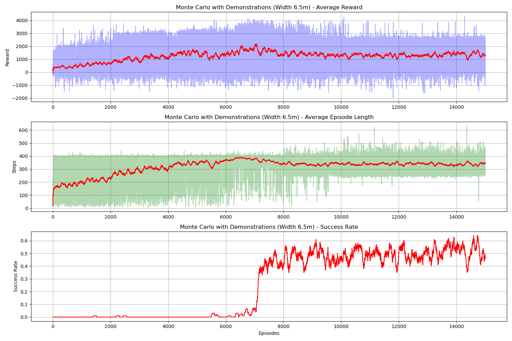
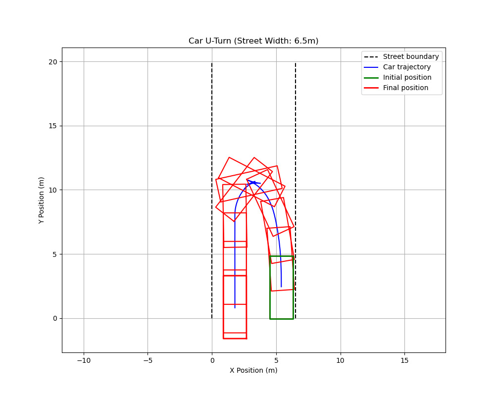

# Autonomous U-Turn

## Project Overview

This project focuses on training a reinforcement learning (RL) agent to perform a U-turn maneuver with a car in a deterministic environment. The agent must learn to navigate the car autonomously while adhering to geometric constraints and avoiding leaving the street boundaries. 

The project is implemented using Monte Carlo methods for policy optimization.

## Requirements

- Python 3.x
- Numpy
- Pygame (used for demonstration)
- Matplotlib (for visualizations)

 
## Usage

### Without demonstration:

```bash
python main.py --mode train --width 6.5 --episodes 5000
```

### With demonstration:

```bash
run python main.py --mode demo --width 6.5 --episodes 5000
```

### Evaluate a trained policy and print success rate & rewards:

```bash
python main.py --mode evaluate --width 6.5
```

### Replay a trained policy using visualization:

```bash
python main.py --mode visualize --width 6.5
```


## Key Components
### Environment Implementation (car_environment.py)
* State Space: Car position (x,y) and orientation (γ)

* Action Space: 133 discrete actions (19 wheel angles × 7 speeds)

* Termination Conditions: Successful U-turn (180° rotation), Leaving street boundaries, Max steps (400)

### Interactive Demo (interactive_demo.py)
* Pygame-based visualization

* Keyboard controls for human demonstrations

* Demonstration recording and saving

### Learning Algorithm (monte_carlo.py)
Monte Carlo Control with:

* Demonstration initialization

* Staged epsilon decay

* Demonstration bias decay

### Training Pipeline (main.py)
* Multiple training modes: Standard Monte Carlo, Demonstration-guided, Improved training with hyperparameter tuning

* Evaluation metrics tracking

* Policy visualization tools


## Results

<p align="center">
  
</p>

<p align="center">
  
</p>
